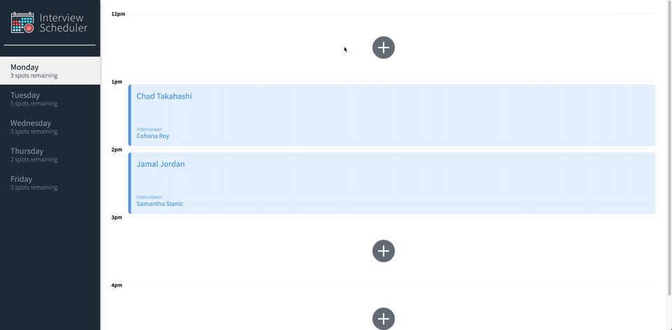
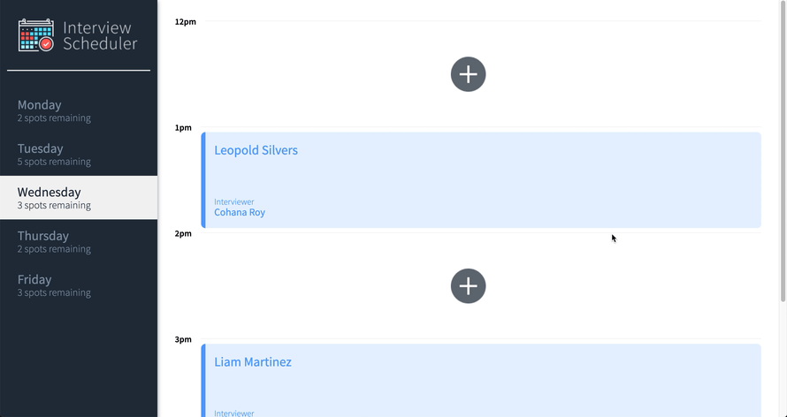
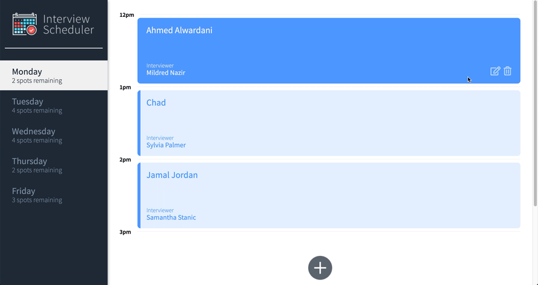

# Interview Scheduler

A React application that allows users to book and cancel interviews.

## Final Product

## 

## 

## 

## 

## 

## Dependencies

- React
- React Testing Library
- Webpack Development Server
- Axios
- Class Names
- Cypress
- Lodash

## Setup

Install dependencies with `npm install`.

## Running Webpack Development Server

```sh
npm start
```

## Running Jest Test Framework

```sh
npm test
```

## Running Storybook Visual Testbed

```sh
npm run storybook
```
